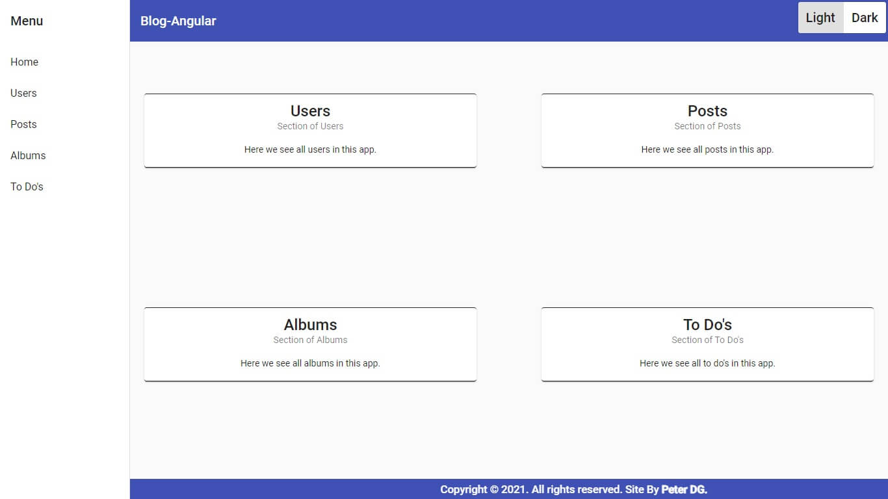
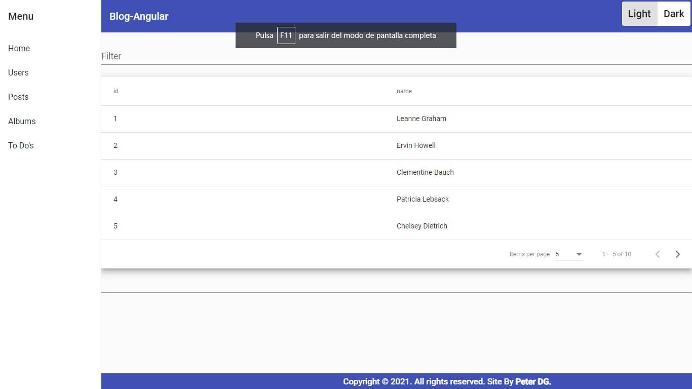
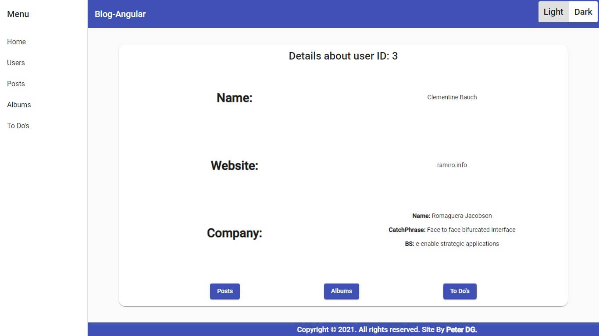
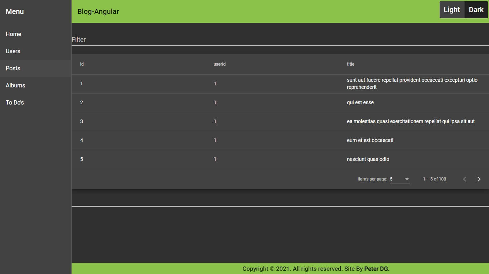
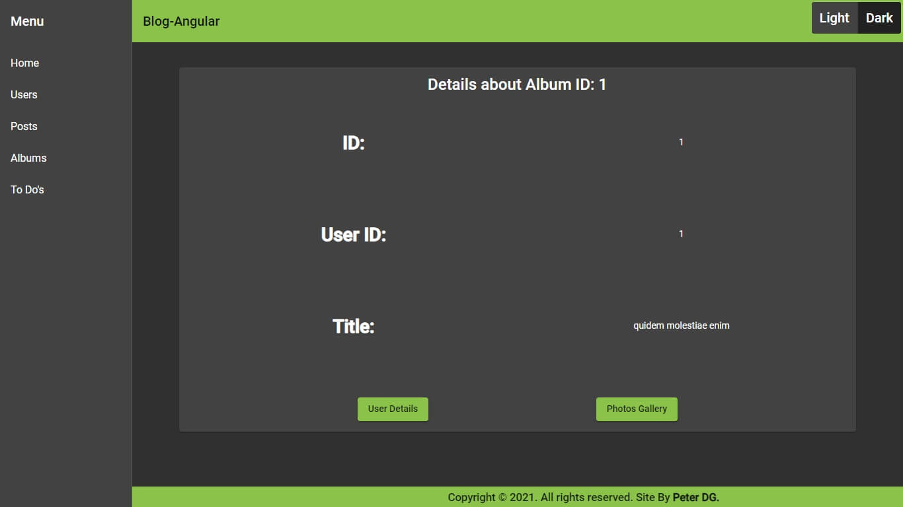
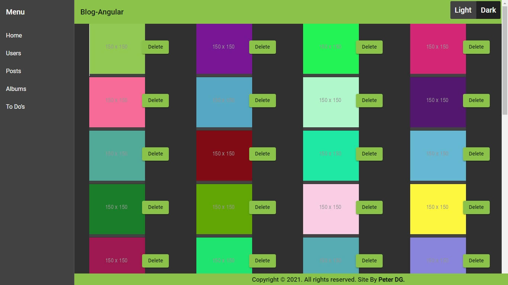

<h2 align="center">
  ChallengeJS - Angular Blog
  
</h2>

---

# Tabla de Contenido - Index

1. [¿Qué es esto?](#what)
2. [Instalar y Correr la Aplicación](#run)
3. [Imagenes del Proyecto](#img)
4. [Licencia](#license)

---

### ¿Qué es esto? 

En el marco de el desafío <b>"Challenge JS"</b> sobre Typescript y Angular propuesto por <b>Alkemy</b> para la acceleración en Angular.

[ChallengeJS - PDF](ChallengeIndividualAngular.pdf)

---

## Instalar y Correr la Aplicación 

Puedes ver el blog desplegado, en el siguiente link:

[Angular Blog](https://peterdamiang.github.io/ChallengeAngularBlog/)

O puedes clonarlo y verlo en local:

1. En tu consola favorita coloca:

`git clone https://github.com/PeterDamianG/ChallengeAlkemyAngular.git`

2. En el lugar donde lo hayas descargado, nos movemos al directorio:

`cd ChallengeAlkemyAngular`

3. El siguiente paso consiste en instalar todas las dependencias del desarrollo:

`npm install`

6. El último paso es levantar nuestro blog de ejemplo, en modo de desarrollo:

`npm run start`

La aplicación comenzara a funcionar en [LocalHost](http://localhost:4200/).

---

#### Imagenes del Proyecto 

---

##### Licencia 

[Licencia Github](LICENSE)